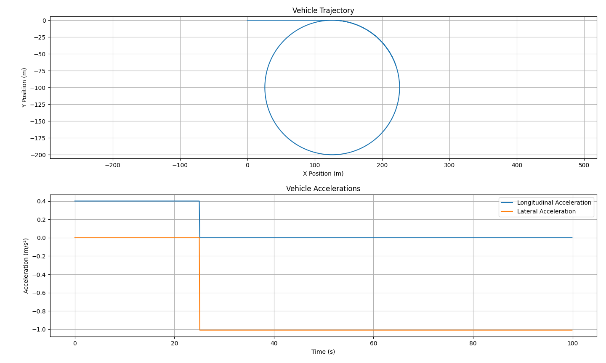
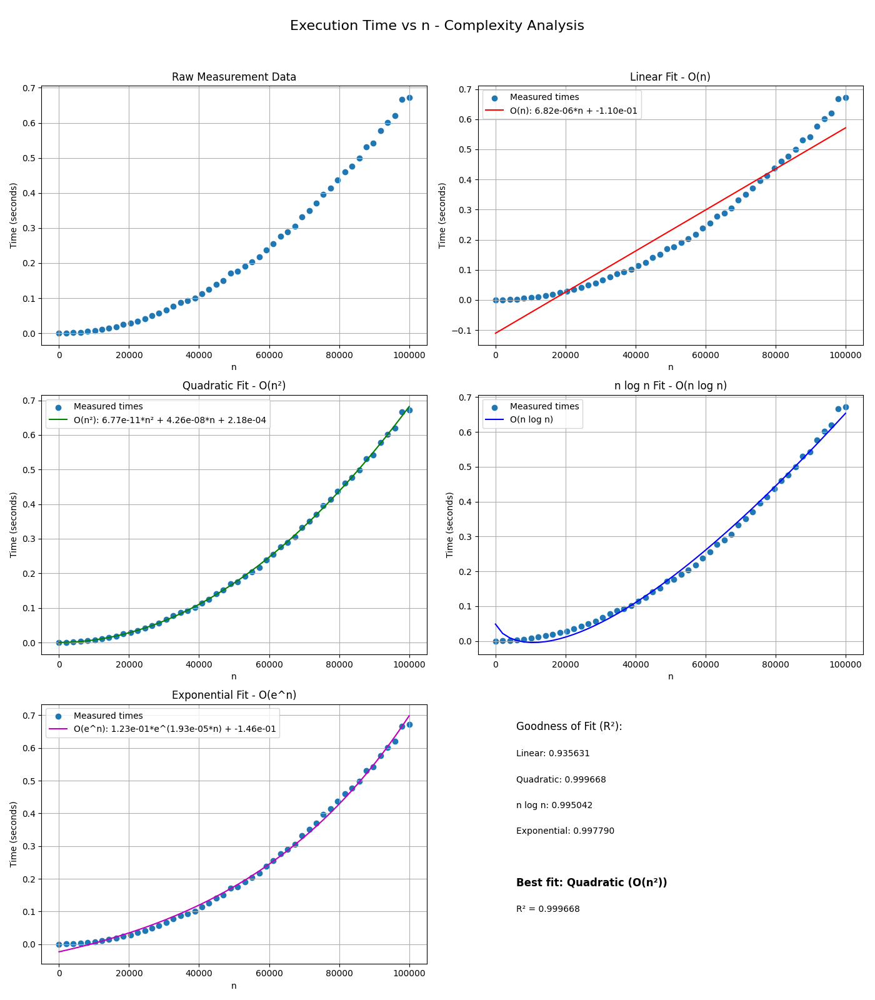

## Setup Instructions

### Setting up the Virtual Environment

1. Create a virtual environment:
   ```bash
   python -m venv venv
   ```

2. Activate the virtual environment:
   - On Windows:
     ```bash
     venv\Scripts\activate
     ```
   - On macOS/Linux:
     ```bash
     source venv/bin/activate
     ```

3. Install the required dependencies:
   ```bash
   pip install -r requirements.txt
   ```

### Running the Program

#### Sequence Calculator
To calculate the sequence value for n=100000 and generate the time complexity analysis:

```bash
python sequence.py
```

#### Car Simulator
To run the car simulator:

```bash
python car_simulator.py
```

## Project Structure

- `sequence.py`: Main Python script containing the sequence calculator and analysis code
- `car_simulator.py`: Python script for the car physics simulation
- `sequence_time_complexity.png`: Generated plot showing the time complexity analysis 
- `vehicle_trajectory_acceleration.png`: Generated plot showing results of car_simulator

## Project Overview

### Car Simulator
The car simulator:
1. Provides a physics-based simulation of car movement
2. Allows control of the car through user input commands
3. Implements basic physics principles for realistic car behavior
4. Visualizes the car's position and movement in

#### Results


### Sequence Calculator
This program:
1. Efficiently calculates the nth term of the sequence
2. Measures execution time for various n values
3. Fits different complexity models to the timing data
4. Visualizes the results with plots

#### Time Complexity Analysis

The implemented solution has O(n²) time complexity because:
1. We use a simple iterative approach with a loop that runs (n-1) times
2. Each iteration performs arithmetic on increasingly large numbers
3. As n grows, the sequence values grow exponentially in magnitude
4. Python's arbitrary-precision integer operations take O(m) time where m is the number of bits
5. The number of bits in S_n grows linearly with n, making each operation O(n)

Therefore, O(n) loop iterations × O(n) cost per operation = O(n²) overall complexity.

#### Results

The curve fitting confirms the quadratic relationship between execution time and n, validating the O(n²) time complexity, as shown by the higher R² value for the quadratic model compared to linear.



The graph shows various complexity models fitted to the execution time data, with the quadratic model providing the best fit.
If you have trouble viewing the full image when you run the program, enter full-screen in matplotlib and increase the h-space configuration through the UI (using the option at the bottom to the left of the floppy-disk/save button).